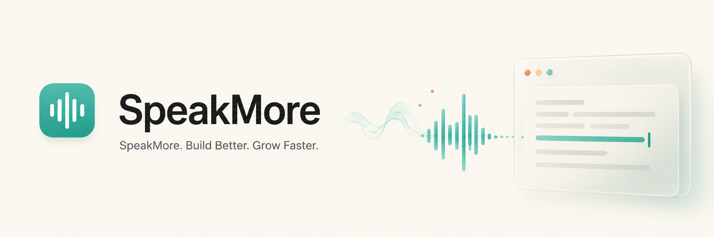

<p align="center">
  
</p>

<h1 align="center">SpeakMore</h1>

<p align="center">
  Cross-platform desktop speech-to-text for local-first dictation workflows.
</p>

<p align="center">
  <a href="BUILD.md">Build from source</a>
  ·
  <a href="docs/asr-providers.md">ASR providers</a>
  ·
  <a href="docs/post-processing.md">Post-processing</a>
  ·
  <a href="CONTRIBUTING.md">Contributing</a>
</p>

<p align="center">
  <a href="https://github.com/OrigArith/SpeakMore/actions/workflows/code-quality.yml">
    
  </a>
  <a href="https://github.com/OrigArith/SpeakMore/actions/workflows/test.yml">
    
  </a>
  <a href="https://github.com/OrigArith/SpeakMore/actions/workflows/playwright.yml">
    
  </a>
  <a href="LICENSE">
    
  </a>
  
</p>

SpeakMore is a desktop app that turns spoken input into text and sends the result back to the app you are already using. Press a shortcut, speak, let SpeakMore transcribe the audio, optionally clean up the transcript, and paste or type the result into the active window.

> [!NOTE]
> SpeakMore is currently a source-first public project. The repository supports source builds and development workflows. Signed installers, updater metadata, package-manager distribution, and public binary releases are not available yet.

## Why SpeakMore

- **Fast dictation loop:** start recording with a global shortcut, speak, and return text to the active app.
- **Local-first recognition:** use local ASR when you want audio and transcripts to stay on your machine.
- **Explicit cloud path:** configure cloud ASR only when you want a remote provider to handle recognition.
- **Model flexibility:** manage local model families, languages, acceleration options, and provider-specific settings.
- **Post-processing:** clean dictation, format text, or prepare concise messages after recognition.
- **Private history:** keep local transcript history with retry, copy, edit, and clear privacy boundaries.

## Quick Start

See [BUILD.md](BUILD.md) for platform prerequisites before running SpeakMore from source.

```bash
git clone https://github.com/OrigArith/SpeakMore.git
cd SpeakMore
bun install
bun run tauri dev
```

The required VAD model and model catalog are tracked in this repository. Optional ASR models can be downloaded through the app or installed manually.

On macOS, if CMake rejects an older dependency policy during setup, run:

```bash
CMAKE_POLICY_VERSION_MINIMUM=3.5 bun run tauri dev
```

### Agent-Assisted Setup

If you use a local coding agent, you can ask it to prepare and run SpeakMore from source.

Copy this prompt:

```text
Help me build and run SpeakMore from source on this machine.

Repository:
https://github.com/OrigArith/SpeakMore

Please:
1. Read README.md and BUILD.md first.
2. Detect my OS and install or list the required platform prerequisites.
3. Install project dependencies with bun install.
4. Start the development build with bun run tauri dev.
5. If the build fails, inspect the error, explain the cause, and apply only minimal fixes needed for local development.
6. Do not create releases, tags, signed installers, or publish anything.
7. Keep local credentials, API keys, clipboard contents, and transcript data private.
```

### Development Checks

```bash
bun run lint
bun run build
bun run check:translations
cd src-tauri && cargo check
```

## How It Works

1. Press a configured shortcut to start recording.
2. Speak while recording is active.
3. SpeakMore filters silence and sends the captured audio to the selected ASR path.
4. SpeakMore returns the transcript to the active app through paste or typing.

Recognition can use:

- Local models, including Whisper-family models and other supported local ASR engines
- Cloud ASR providers, if configured in settings
- Realtime cloud preview where supported by the selected provider

Post-processing is separate from recognition. You can use the raw transcript directly, or run it through a preset that cleans dictation, formats text, or prepares a concise message.

```text
audio input -> VAD -> ASR provider -> transcript -> optional post-processing -> paste/copy/history
```

## Privacy Model

SpeakMore has two different privacy modes:

- **Local ASR:** audio and transcripts stay on your machine unless you export or share them.
- **Cloud ASR:** audio is sent to the provider you configure. Provider credentials and network access are required.

SpeakMore should not write provider API keys, previous clipboard contents, or cloud provider secrets into transcript history or exported data. See [docs/history.md](docs/history.md) for the local history privacy boundary.

## Supported Platforms

| Platform | Current source-build target                     |
| -------- | ----------------------------------------------- |
| macOS    | Apple Silicon primary; Intel best effort        |
| Windows  | Windows x64 primary; Windows ARM64 experimental |
| Linux    | x64 and arm64 source builds                     |

On Linux, X11 users should install `xdotool` for reliable text insertion. Wayland users should install `wtype` or configure desktop-level shortcuts that call the CLI flags. The recording overlay is disabled by default on Linux because some compositors may give it focus and interfere with paste behavior.

If startup fails with `libgtk-layer-shell.so.0`, install the runtime package:

| Distro        | Package               |
| ------------- | --------------------- |
| Ubuntu/Debian | `libgtk-layer-shell0` |
| Fedora/RHEL   | `gtk-layer-shell`     |
| Arch Linux    | `gtk-layer-shell`     |

Useful Linux workarounds:

```bash
SPEAKMORE_NO_GTK_LAYER_SHELL=1 speakmore
WEBKIT_DISABLE_DMABUF_RENDERER=1 speakmore
```

## Documentation

| Document                                                     | Use it for                                     |
| ------------------------------------------------------------ | ---------------------------------------------- |
| [BUILD.md](BUILD.md)                                         | Platform prerequisites and source builds       |
| [CONTRIBUTING.md](CONTRIBUTING.md)                           | Pull request and contribution workflow         |
| [CONTRIBUTING_TRANSLATIONS.md](CONTRIBUTING_TRANSLATIONS.md) | Adding or updating translations                |
| [docs/asr-providers.md](docs/asr-providers.md)               | Local and cloud ASR provider boundaries        |
| [docs/post-processing.md](docs/post-processing.md)           | Transcript cleanup and formatting presets      |
| [docs/history.md](docs/history.md)                           | Local history storage and privacy boundary     |
| [docs/model-sources.md](docs/model-sources.md)               | Model and third-party source notes             |
| [docs/release-readiness.md](docs/release-readiness.md)       | Signed binary release checklist                |
| [docs/asset-provenance.md](docs/asset-provenance.md)         | Non-code asset provenance and ownership status |

## Architecture

SpeakMore combines a Rust backend with a React settings UI:

- `src-tauri/src/`: Tauri app, audio, shortcuts, history, settings, transcription, and model management
- `src-tauri/src/audio_toolkit/`: device I/O, recording, resampling, and VAD helpers
- `src-tauri/src/commands/`: Tauri command handlers
- `src/`: React UI, settings screens, onboarding, overlay, stores, and generated Tauri bindings
- `src/i18n/`: i18next setup and locale files

## CLI

SpeakMore supports command-line flags for controlling a running instance:

```bash
speakmore --toggle-transcription
speakmore --toggle-post-process
speakmore --cancel
speakmore --start-hidden
speakmore --no-tray
speakmore --debug
```

On macOS app bundles, invoke the binary directly:

```bash
/Applications/SpeakMore.app/Contents/MacOS/SpeakMore --toggle-transcription
```

## Manual Model Installation

If automatic model downloads are blocked by a proxy or firewall, place model files in the app data `models` directory and restart SpeakMore.

Typical app data locations:

- macOS: `~/Library/Application Support/app.speakmore.desktop/`
- Windows: `C:\Users\{username}\AppData\Roaming\app.speakmore.desktop\`
- Linux: `~/.config/app.speakmore.desktop/`

For model source details, filenames, and attribution notes, see [docs/model-sources.md](docs/model-sources.md).

## Release and Distribution

Public binary releases, signed installers, package-manager distribution, updater signatures, and a `latest.json` updater endpoint are not available yet. Local bundles built from source are useful for development and testing, but they are not official project releases.

Release readiness is tracked in [docs/release-readiness.md](docs/release-readiness.md).

## Contributing

Issues and pull requests are welcome. Please read [CONTRIBUTING.md](CONTRIBUTING.md) before opening a PR.

For security issues, do not open a public issue. See [SECURITY.md](SECURITY.md).

## License

SpeakMore is licensed under the MIT License. See [LICENSE](LICENSE).

This project is based on the MIT-licensed Handy project by CJ Pais. Additional third-party notices are documented in [NOTICE.md](NOTICE.md) and [docs/model-sources.md](docs/model-sources.md).

## Acknowledgments

- Handy, the original MIT-licensed upstream project
- OpenAI Whisper
- whisper.cpp and ggml
- Silero VAD
- Tauri
- The broader open-source speech recognition community
